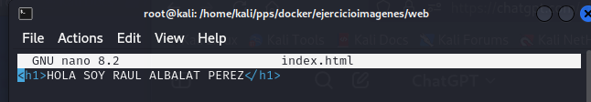

# Ejercicio para entregar

## Servidor web

1. Arranca un contenedor que ejecute una instancia de la imagen `php:7.4-apache`, que se llame **web** y que sea accesible desde tu equipo en el puerto 8000.
     
     El primer paso seá crear  una carpeta donde meteremos el contenedor **docker-compose.yml** y el fichero **web** donde meteremos er archivo **index.html** y **index.php**
     - nota: La carpeta del contenedor (/var/www/html) El la carpeta raiz del servicio web del contenedor. Docker enlazará la carpeta local **./web** con esta carpeta dle contenedor de manera que cualquier archivo que coloquemos en "web" se verá automaticamente en ell contenedor dentro de /var/www/html. 


    

    

2. Coloca en el directorio raíz del servicio web (`/var/www/html`) de dicho contenedor un fichero llamado `index.html` con el siguiente contenido:

    ```html
    <h1>HOLA SOY RAUL ALBALAT PEREZ</h1>
    ```
      
   

3. Coloca en ese mismo directorio raíz un archivo llamado `index.php` con el siguiente contenido:
     Para ello  dentro de **web**  hago un `nano index.php` y lo escribo.

    ```php
    <?php echo phpinfo(); ?>
    ```
     

4. editamos el fichero **docker-compose.yml** y creamos las tanto el servicio apache como el servicio mariadb

    ```
            version: '3.9'

        services:
        web:
            image: php:7.4-apache
            container_name: web
            ports:
            - "8000:80"
            volumes:
            - ./web:/var/www/html

        bbdd:
            image: mariadb
            container_name: bbdd
            ports:
            - "3336:3306"
            environment:
            MARIADB_ROOT_PASSWORD: root
            MARIADB_DATABASE: prueba
            MARIADB_USER: invitado
            MARIADB_PASSWORD: invitado
    ```
     

5. Arrancamos el contenedor con  **docker-compose up -d"** y comprobamos que esta ejecutandose con **docker ps** 

    
6. Comprobamos que podemos metenernos desde  [localhost](http://localhost:8000/index.html)
    
   


## Servidor de base de datos

1. Arranca un contenedor que se llame **bbdd** y que ejecute una instancia de la imagen `mariadb` para que sea accesible desde el puerto 3336.
   He creado el contenedor con el el servicio **bbdd** en el punto anterior y añadía las siguentes variabels de entorno para poder ejecutar mariadb.
       ```
        bbdd:
            image: mariadb
            container_name: bbdd
            ports:
            - "3336:3306"
            environment:
            MARIADB_ROOT_PASSWORD: root
            MARIADB_DATABASE: prueba
            MARIADB_USER: invitado
            MARIADB_PASSWORD: invitado
       ```
    
2. Antes de arrancarlo, visita la página del contenedor en Docker Hub y establece las variables de entorno necesarias para que:

    - La contraseña de `root` sea **root**.
    - Se cree automáticamente una base de datos llamada **prueba** al arrancar.
    - Se cree el usuario **invitado** con la contraseña **invitado**.

3. He instalado MariaDB client ya que no lo tenía en el kali.
    ```
        sudo apt update && sudo apt install mariadb-client -y
    ```

    
4. Conecto al servidor mariadb ya que arranque el servicio anteriormente.
        
    

## Entregables

Deberás entregar los siguientes pantallazos comprimidos en un **zip** o en un **documento PDF**:

1. Pantallazo que desde el navegador muestre el fichero `index.html`.
2. Pantallazo que desde el navegador muestre el fichero `index.php`.
3. Pantallazo donde se vea el tamaño del contenedor **web** después de crear los dos ficheros.
4. Pantallazo donde desde un cliente de base de datos (instalado en tu ordenador) se pueda observar que hemos podido conectarnos al servidor de base de datos con el usuario creado y que se ha creado la base de datos **prueba** (`show databases`). El acceso se debe realizar desde el ordenador que tienes instalado Docker, no desde dentro del contenedor (es decir, no usar `docker exec`).
5. Pantallazo donde se comprueba que no se puede borrar la imagen **mariadb** mientras el contenedor **bbdd** está creado.
