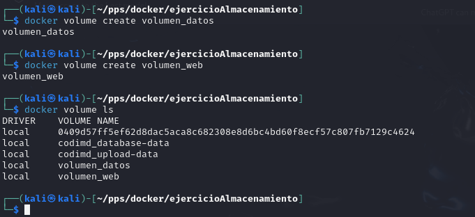

# Ejercicios para Entregar

## Opción 1: Creación y Uso de Volúmenes

### **Instrucciones**
1. **Crear volúmenes:**
   - Crear los volúmenes `volumen_datos` y `volumen_web` usando el comando `docker volume`.

    Ejecutamos los comandos de creacion de volumens 
      ```
        docker volume create volumen_datos
        docker volume create volumne_web
      ```
    Verificamos la creación de los volumenes 

      ```
        docker volume ls

      ```

      


2. **Arrancar contenedores:**
   - Iniciar un contenedor llamado `c1` con la imagen `php:7.4-apache` que monte el volumen `volumen_web` en la ruta `/var/www/html` y que esté disponible en el puerto `8080`.
     Para inicar el contenedor c1 sería.
      ```
       docker run -d --name c1 -p 8080:80 -v columen_web:/var/www/html php:7.4-apache
      ```
      

     Verificamos que se creo correctamente el container.
      ```
       docker container ls
      ```
     


   - Iniciar un contenedor llamado `c2` con la imagen `mariadb` que monte el volumen `volumen_datos` en la ruta `/var/lib/mysql`, estableciendo la contraseña de root como `admin`.
     Para iniciar el contenedor c2 sería.
      ```
       docker run -d --name c2 -e MYSQL_ROOT_PASSWORD=admin -v volumen_datos:/var/lib/mysql mariadb
      ```
     

     Verificamos que se creo correctamente el container.

     


3. **Intentar borrar el volumen `volumen_datos`:**
   - Detener y eliminar el contenedor `c2`, luego intentar eliminar el volumen.
     Para detener y eliminar el contenedor `c2` hacemos lo siguiente.
       ```
         docker stop c2
         docker rm c2
       ```
       

     Para borrar el volumen usamos:
       
       ```
         docker volume rm volumen_datos
       ``` 
     


4. **Trabajar con el contenedor `c1`:**
   - Crear o copiar un archivo `index.html` dentro del contenedor `c1`. Verificar que el contenido es accesible.
5. **Crear un nuevo contenedor `c3`:**
   - Eliminar el contenedor `c1` y crear otro contenedor `c3` con las mismas características, sirviendo en el puerto `8081`.

### **Pantallazos a Entregar**
1. Pantallazo mostrando los dos volúmenes creados.
2. Pantallazo con la orden para arrancar el contenedor `c1` usando el volumen `volumen_web`.
3. Pantallazo con la orden para arrancar el contenedor `c2` usando el volumen `volumen_datos`.
4. Pantallazo mostrando el proceso para borrar el volumen `volumen_datos`.
5. Pantallazo mostrando el borrado de `c1` y la creación de `c3`.
6. Pantallazo mostrando el acceso al contenedor `c3`.

---

## Opción 2: Bind Mount para Compartir Datos

### **Instrucciones**
1. **Preparar la carpeta:**
   - Crear una carpeta llamada `saludo` y dentro de ella un archivo `index.html` con el contenido:
     ```html
     <h1>HOLA SOY XXXXXX</h1>
     ```
     Sustituye `XXXXXX` por tu nombre.
2. **Arrancar contenedores:**
   - Crear dos contenedores basados en la imagen `php:7.4-apache` que realicen un **bind mount** de la carpeta `saludo` a la carpeta `/var/www/html` en los contenedores.
     - Contenedor `c1`: disponible en el puerto `8181`.
     - Contenedor `c2`: disponible en el puerto `8282`.
3. **Modificar el archivo:**
   - Modificar el contenido del archivo `index.html` en la carpeta `saludo`.
   - Verificar que los cambios se reflejan en ambos contenedores sin necesidad de reiniciarlos.

### **Pantallazos a Entregar**
1. Pantallazo con la orden para arrancar el contenedor `c1` (puerto `8181`) realizando el bind mount.
2. Pantallazo con la orden para arrancar el contenedor `c2` (puerto `8282`) realizando el bind mount.
3. Pantallazo mostrando el contenido de `index.html` accediendo al contenedor `c1`.
4. Pantallazo mostrando el contenido de `index.html` accediendo al contenedor `c2`.
5. Pantallazo(s) mostrando los contenedores tras modificar el archivo `index.html`.

---

## Notas

- Asegúrate de usar comandos claros y organizados para crear, arrancar y gestionar los contenedores.
- Revisa que los contenedores estén accesibles desde los puertos asignados.
- Guarda los pantallazos y comprímelos en un archivo ZIP o PDF para su entrega.

¡Buena suerte con los ejercicios!
