# Práctica de Docker

## Ejercicios para entregar

### Ejercicio 1: Trabajar con redes Docker

#### **Objetivo:**
Configurar dos redes Docker tipo **BRIDGE**, crear dos contenedores **Ubuntu 20.04** y realizar pruebas de conectividad entre ellos.

---

### **Pasos a realizar**:

#### Paso 1. **Creamos las redes Docker**

  El primer paso que vamos a realizar será crea una **red1* con las siguientes especificaciones:
- **Red1**:
  - Nombre: `red1`
  - Dirección de red: `172.28.0.0`
  - Máscara de red: `255.255.0.0`
  - Gateway: `172.28.0.1`
  
  Para ello adjunto el comando que vamos a usar.

  **Comando**:
  ```bash
  docker network create \
    --driver bridge \
    --subnet 172.28.0.0/16 \
    --gateway 172.28.0.1 red1
  ```
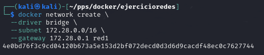

 Creamos la segunda red la cual llamamos **red2**

- **Red2**:
  - Nombre: `red2`
  - Datos automáticos proporcionados por Docker.

  **Comando**:
  ```bash
  docker network create --driver bridge red2
  ```
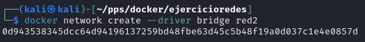
 
---

#### Paso 2. **Creamos los contenedores**

 El siguiente paso será la creación de contenedores **u1** y **u2** que alojará ubuntu:20.04.
 
- **Contenedor u1 en red1 y con IP fija**:
  - Imagen: `ubuntu:20.04`
  - Nombre: `u1`
  - Hostname: `host1`
  - IP: `172.28.0.10`
  - Conectado a: `red1`

  **Comando**:
  ```bash
  docker run -dit --name u1 --hostname host1 \
    --network red1 --ip 172.28.0.10 ubuntu:20.04
  ```

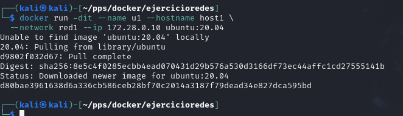
 
 
  **Instalamos `ping` en u1**:
  ```bash
  docker exec -it u1 bash
  apt update && apt install -y inetutils-ping
  exit
  ```

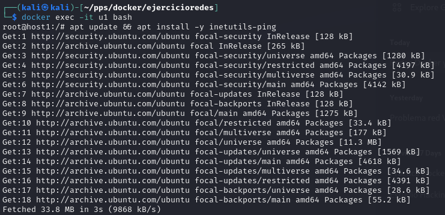

- **Instalamos el Contenedor u2**:
  - Imagen: `ubuntu:20.04`
  - Nombre: `u2`
  - Hostname: `host2`
  - Conectado a: `red2`

  **Comando**:
  ```bash
  docker run -dit --name u2 --hostname host2 \
    --network red2 ubuntu:20.04
  ```
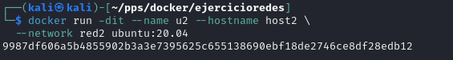

  **Instalamos `ping` en el contenedor u2**:
  ```bash
  docker exec -it u2 bash
  apt update && apt install -y inetutils-ping
  exit
  ```

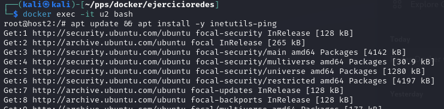
---

#### Paso 3. **Verificamos las configuraciones de red**

- Accedemos al contenedor **u1** y **u2** y actualizamos los repositorios e instalamos *iproute2*
  ```bash
  docker exec -it u1 bash
  apt update && apt install -y iproute2
  ```
  ```bash
  docker exec -it u2 bash
  apt update && apt install -y iproute2
  ```

- Vemos Configuración de red de `u1`:
  ```bash
  docker exec -it u1 ip a
  ```
- Vemos Configuración de red de `u2`:
  ```bash
  docker exec -it u2 ip a
  ```
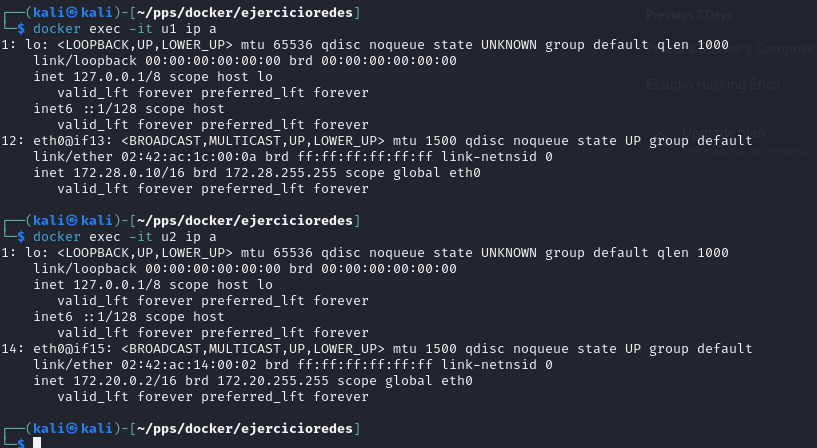
---

#### Paso 4. **Probamos la conectividad inicial**

- Desde `u1` intentar hacer **ping** a `u2` para probar que se pueden conectar. Esto **fallará** ya que cada red funciona como una subred y docker no permite comunicacion entre ellas a no ser que se conecte explicitamente a un contenedor varias redes con `docker network connect`
  ```bash
  docker exec -it u1 ping host2
  docker exec -it u1 ping <IP_de_u2>
  ```
- Desde `u2` intentar hacer **ping** a `u1`:
  ```bash
  docker exec -it u2 ping host1
  docker exec -it u2 ping 172.28.0.10
  ```
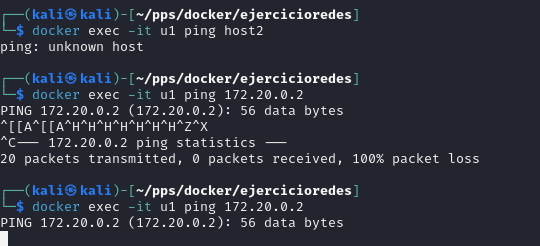
---

#### Paso 5. **Conectamos  `u1` a `red2` y verificamos que ya si tenemos conectividad**

- Conectar `u1` a `red2`:
  ```bash
  docker network connect red2 u1
  ```

- Comprobar conectividad desde `u1` a `u2`:
  ```bash
  docker exec -it u1 ping host2
  docker exec -it u1 ping <IP_de_u2>
  ```
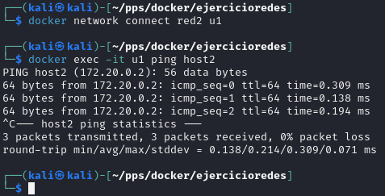
---

#### **Capturas necesarias**
1. Configuración de red del contenedor `u1`.
2. Configuración de red del contenedor `u2`.
3. Fallo de **ping** entre `u1` y `u2` inicialmente.
4. Éxito del **ping** cuando `u1` está conectado a `red2`.

---

### Ejercicio 2: Despliegue de Nextcloud + MariaDB

Vamos a desplegar la aplicación nextcloud con una base de datos (puedes elegir mariadb o PostgreSQL) (NOTA: Para que no te de errores utiiliza la imagen mariadb:10.5). Te puede servir el ejercicio que hemos realizado para desplegar Wordpress. Para ello sigue los siguientes pasos:

#### **Objetivo:**
Desplegar la aplicación **Nextcloud** junto con una base de datos **MariaDB**, asegurando la persistencia de datos.

---

#### Paso 1. **Creamos la red Docker**

**Comando**:
```bash
docker network create nextcloud_net
```
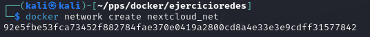

---

#### Paso 2. **Creamos el contenedor de MariaDB**

**Configuración del contenedor mariaDB y variables de entorno**:
- Nombre: `mariadb_container`
- Red: `nextcloud_net`
- Variables de entorno:
  - `MYSQL_ROOT_PASSWORD`: Contraseña del usuario root
  - `MYSQL_DATABASE`: Nombre de la base de datos
  - `MYSQL_USER`: Usuario de la base de datos
  - `MYSQL_PASSWORD`: Contraseña del usuario
- Volumen: `mariadb_data` para persistencia.

**Comando**:
```bash
docker run -d --name mariadb_container \
  --network nextcloud_net \
  -e MYSQL_ROOT_PASSWORD=secret \
  -e MYSQL_DATABASE=nextcloud_db \
  -e MYSQL_USER=nextcloud_user \
  -e MYSQL_PASSWORD=nextcloud_pass \
  -v mariadb_data:/var/lib/mysql \
  mariadb:10.5
```
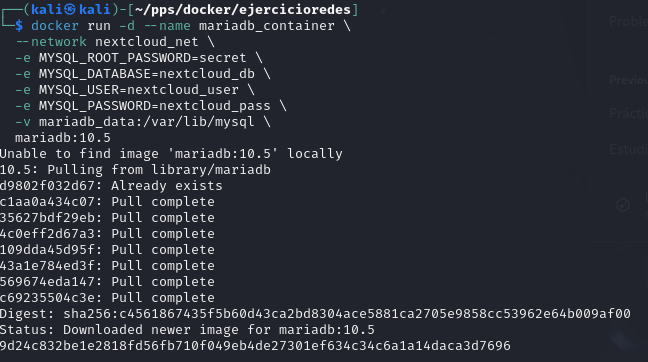

---

#### Paso 3. **Creamos  el contenedor de Nextcloud**

**Configuración del contenedor nextcloud y las variables de entorno**:
- Nombre: `nextcloud_container`
- Red: `nextcloud_net`
- Variables de entorno:
  - `MYSQL_HOST`: Nombre del contenedor de la base de datos
  - `MYSQL_DATABASE`: Nombre de la base de datos
  - `MYSQL_USER`: Usuario de la base de datos
  - `MYSQL_PASSWORD`: Contraseña del usuario
- Volumen: `nextcloud_data` para persistencia.
- Puerto: `8080` en el host, `80` en el contenedor.

**Comando**:
```bash
docker run -d --name nextcloud_container \
  --network nextcloud_net \
  -e MYSQL_HOST=mariadb_container \
  -e MYSQL_DATABASE=nextcloud_db \
  -e MYSQL_USER=nextcloud_user \
  -e MYSQL_PASSWORD=nextcloud_pass \
  -v nextcloud_data:/var/www/html \
  -p 8080:80 \
  nextcloud
```
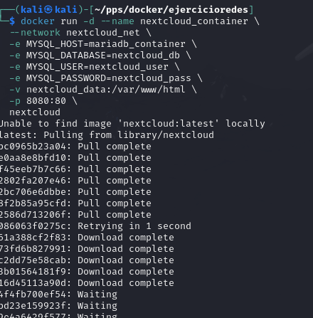
---

#### Paso 4. **Accedemos a la aplicación Nextcloud y vemos que funciona**
- Abrimos un navegador y accedemos a: `http://localhost:8080`.
 
 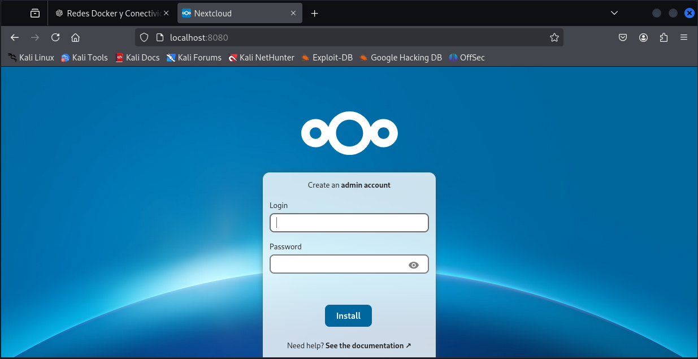

- Configuramos una cuenta de usuario **ralbalatp01**y verificamos la conexión con la base de datos. 

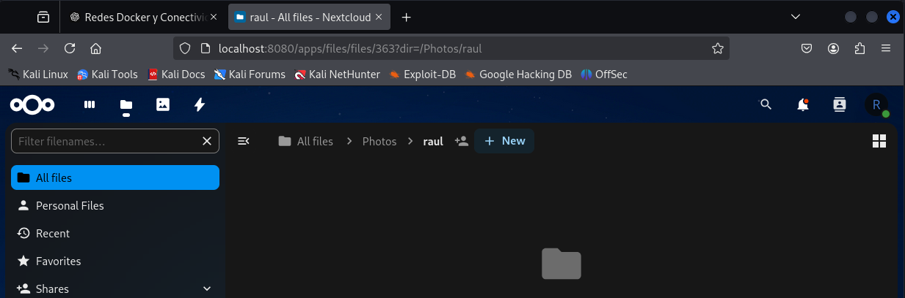


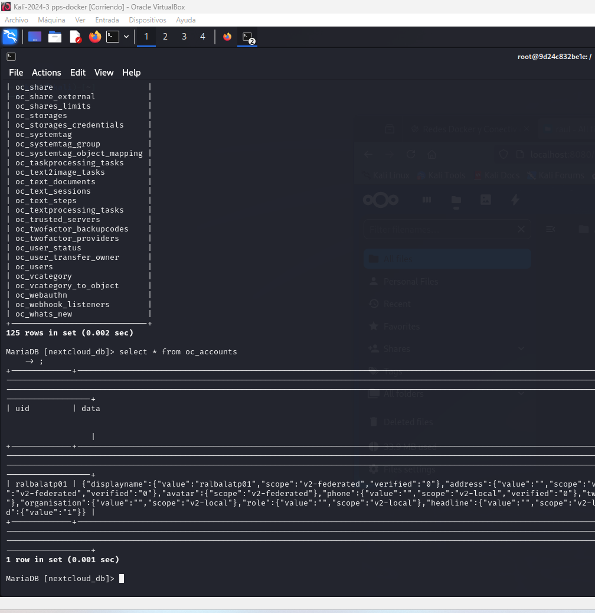

---

#### **Capturas necesarias**
1. Instrucción para crear el contenedor de **MariaDB**.
2. Instrucción para crear el contenedor de **Nextcloud**.
3. Acceso a la aplicación desde el navegador web.

---

## **Entrega:**
- Comprime las capturas de pantalla en un archivo **ZIP** o documento **PDF**.
- Entrega el archivo a través de la plataforma correspondiente.
