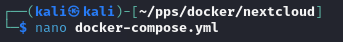
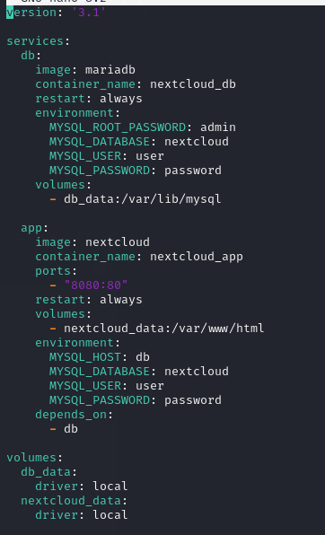
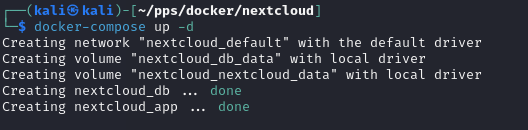
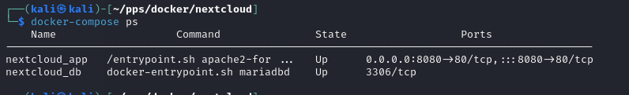
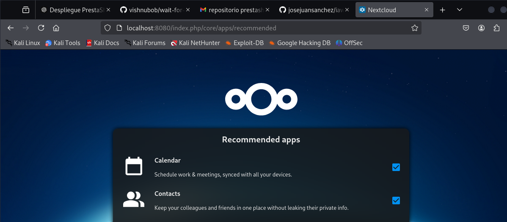

# Ejercicios para entregar


## 2. Despliegue de Nextcloud

Vamos a desplegar la aplicación **Nextcloud** con una base de datos (puedes elegir **MariaDB** o **PostgreSQL**) utilizando **Docker Compose**. Puedes usar como modelo el fichero `docker-compose.yml` que hemos estudiado para desplegar **WordPress**.

### **Pasos a seguir**
1. Creamos un directorio **nextcloud** donde instalaremos el docker-compose.yml



2. Dentro de un directorio, crea un fichero `docker-compose.yml` para realizar el despliegue de **Nextcloud** con una base de datos.  
   *Recuerda las variables de entorno y la persistencia de la información.*



3. Levantamos el escenario con:
   ```bash
   docker-compose up -d
   ```


4. Muestra los **contenedores** con la instrucción:
   ```bash
   docker-compose ps
   ```


5. Accede a la aplicación y comprueba que funciona.



6. Comprueba el almacenamiento definido y verifica que se ha creado una nueva red de tipo **bridge**.

7. Borra el escenario con:
   ```bash
   docker-compose down
   ```

---

### **Entrega**
Deberás entregar los siguientes pantallazos comprimidos en un **ZIP** o en un documento **PDF**:
1. Pantallazo donde se vea el **fichero `docker-compose.yml`**.
2. Pantallazo donde se vean **los contenedores funcionando** con la instrucción `docker-compose`.
3. Pantallazo donde se vea el **acceso desde el navegador** a la aplicación.
