# Ejercicios Docker

## Ejercicio 1: Creación de una imagen a partir de un contenedor

### Paso 1. Arrancamos  el contenedor

```bash
docker run -it --name comandos_redes ubuntu
```
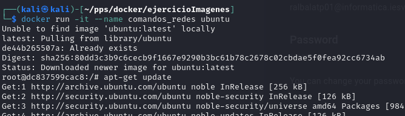

### Paso 2. Instalación de herramientas de red
Dentro del contenedor, ejecutamos los siguientes comandos:
```bash
apt-get update
apt-get install -y inetutils-ping iproute2 dnsutils
```
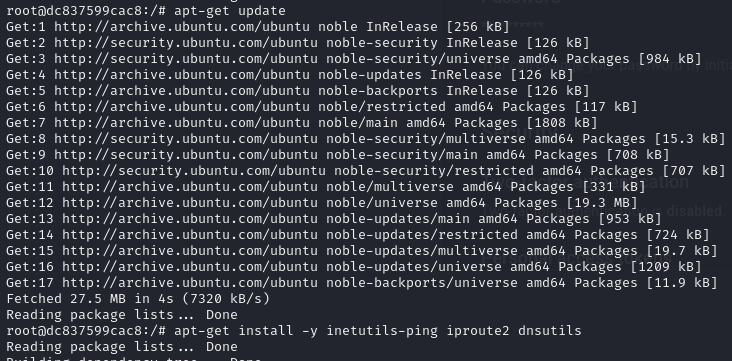

### Paso 3. Creamos la imagen a partir del contenedor creado (mi usuario es ralbalatp01)
Salimos del contenedor con `exit` y creamos  una imagen:
```bash
docker commit comandos_redes ralbalatp01/comandos_redes
```
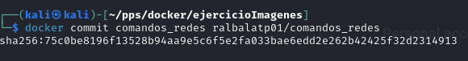

### Paso 4. Subimos la imagen a Docker Hub 
Inicia sesión en Docker Hub:
```bash
docker login
```
Sube la imagen:
```bash
docker push ralbalatp01/comandos_redes
```
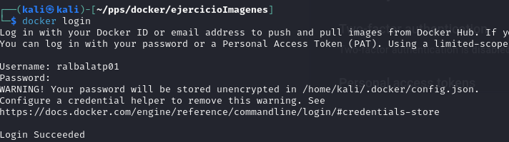

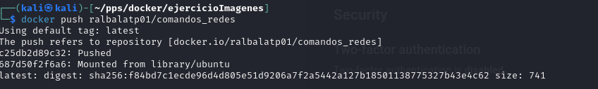

### Paso 5. Descargar y probar la imagen
Elimina la imagen local (opcional):
```bash
docker rmi ralbalatp01/comandos_redes
```
Descarga la imagen desde Docker Hub:
```bash
docker pull ralbalatp0/comandos_redes
```
Crea un contenedor:
```bash
docker run -it ralbalatp0/comandos_redes
```
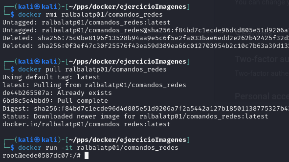
---

## Ejercicio 2: Creación de una imagen a partir de un Dockerfile
 Creamos la carperta `ejercicioImagenes' donde meteremos tanto el **index.html** como **Dockerfile**
### Paso 1. Crear la página web estática
Crea un archivo `index.html` con el siguiente contenido: 
```html
    <h1>¡Hola, Docker! soy Raul</h1>
```
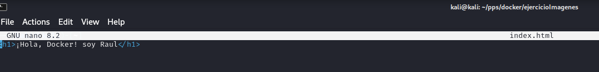

### Paso 2. Escribir el Dockerfile
En el mismo directorio, crea un archivo `Dockerfile` con el siguiente contenido:
```Dockerfile
FROM nginx:alpine
COPY index.html /usr/share/nginx/html/index.html
```
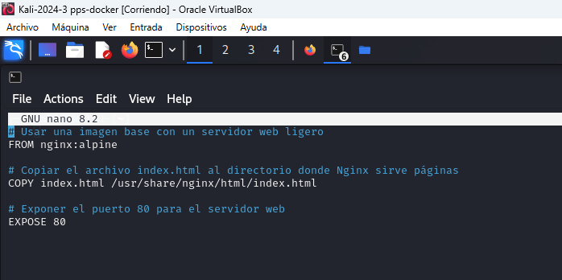

### Paso 3. Crear la imagen
Ejecuta el siguiente comando desde el directorio donde están los archivos:
```bash
docker build -t ralbalatp01/mi_servidor_web .
```
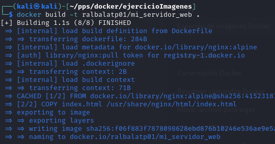

### Paso 4. Subir la imagen a Docker Hub
Inicia sesión si es necesario:
```bash
docker login
```
Sube la imagen:
```bash
docker push ralbalatp01/mi_servidor_web
```
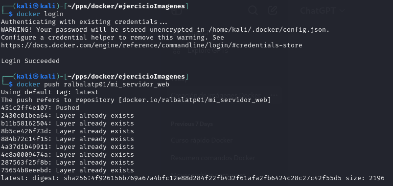

 Verificamos que se ha subido la imagen.

 

### Paso 5. Descargar y probar la imagen
Elimina la imagen local (opcional):
```bash
docker rmi ralbalatp01/mi_servidor_web
```
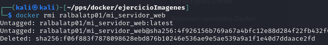

Descarga la imagen desde Docker Hub:
```bash
docker pull ralbalatp01/mi_servidor_web
```
Crea un contenedor:
```bash
docker run -d -p 8080:80 ralbalatp01/mi_servidor_web
```


Verifica la página accediendo a `http://localhost:8080`.

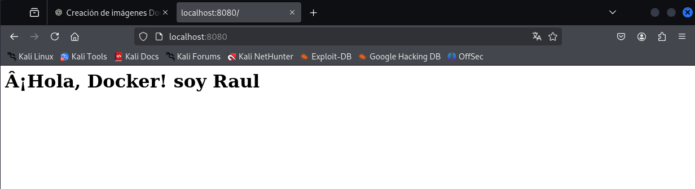

---

## Entrega
Sube un archivo comprimido o PDF con los siguientes elementos:

### Ejercicio 1
- Pantallazo del contenedor corriendo (`docker ps`).
- Pantallazo del comando `docker commit`.
- Pantallazo del panel de Docker Hub mostrando la imagen subida.
- Pantallazo del comando `docker pull` y del contenedor creado nuevamente.

### Ejercicio 2
- Pantallazo del contenido del `Dockerfile`.
- Pantallazo del comando `docker build`.
- Pantallazo del panel de Docker Hub mostrando la imagen subida.
- Pantallazo del comando `docker pull` y la página cargada en el navegador.